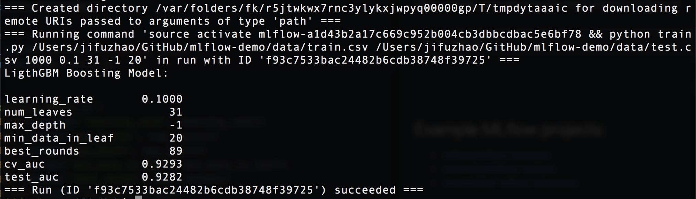
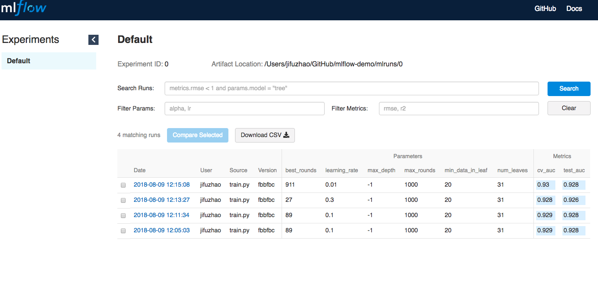

# mlflow-demo
Simple Demo of MLflow Project with LightGBM

***
## Data
[Adult Data Set](http://archive.ics.uci.edu/ml/datasets/Adult) from UCI Machine Learning Repository

| Variable       | Explanation                                                               |
| -------------- | ------------------------------------------------------------------------- |
| age            | continuous                                                                |
| workclass      | Private, Self-emp-not-inc, Self-emp-inc, Federal-gov, Local-gov, State-gov, Without-pay, Never-worked                                                                                       |
| fnlwgt         | continuous                                                                |
| education      | Bachelors, Some-college, 11th, HS-grad, Prof-school, Assoc-acdm, Assoc-voc, 9th, 7th-8th, 12th, Masters, 1st-4th, 10th, Doctorate, 5th-6th, Preschool                                        |
| education-num  | continuous                                                                |
| marital-status | Married-civ-spouse, Divorced, Never-married, Separated, Widowed, Married-spouse-absent, Married-AF-spouse                                                                                       |
| occupation     | Tech-support, Craft-repair, Other-service, Sales, Exec-managerial, Prof-specialty, Handlers-cleaners, Machine-op-inspct, Adm-clerical, Farming-fishing, Transport-moving, Priv-house-serv, Protective-serv, Armed-Forces                                                                                       |
| relationship   | Wife, Own-child, Husband, Not-in-family, Other-relative, Unmarried        |
| race           | White, Asian-Pac-Islander, Amer-Indian-Eskimo, Other, Black               |
| sex            | Female, Male                                                              |
| capital-gain   | continuous                                                                |
| capital-loss   | continuous                                                                |
| hours-per-week | continuous                                                                |
| native-country | United-States, Cambodia, England, Puerto-Rico, Canada, Germany, Outlying-US(Guam-USVI-etc), India, Japan, Greece, South, China, Cuba, Iran, Honduras, Philippines, Italy, Poland, Jamaica, Vietnam, Mexico, Portugal, Ireland, France, Dominican-Republic, Laos, Ecuador, Taiwan, Haiti, Columbia, Hungary, Guatemala, Nicaragua, Scotland, Thailand, Yugoslavia, El-Salvador, Trinadad&Tobago, Peru, Hong, Holand-Netherlands           |
| target         | >50K, <=50K                                                               |

***
## Feature Engineering

Since this demo project doesn't focus on machine learning algorithms, so only simple feature engineering steps are implemented. More specifically,

* target: transform '>50K' as 1 and '<=50K' as 0
* fill missing categorical value with 'Missing' and apply label-encoder
* fill missing numerical value with median value from training set
* since the data set is imbalanced, AUC is used as the metric

***
## Modeling

Gradient Boosting model from LigthGBM are implemented. Check the [documentation](http://lightgbm.readthedocs.io/en/latest/index.html) for details.


***
## How to run the code
* Method 1:

```console
$ git clone https://github.com/JifuZhao/mlflow-demo.git
$ mlflow run mlflow-demo \
-P train_path=absolute path/mlflow-demo/data/train.csv \
-P test_path=absolute path/mlflow-demo/data/test.csv \
-P num_boost_round=1000 -P learning_rate=0.1 -P num_leaves=31 \
-P max_depth=-1 -P min_data_in_leaf=20
```

Note: You need to change the file path to be your local absolute path.

After the code successfully runs, you can get the following results:



* Method 2:

```console
$ git clone https://github.com/JifuZhao/mlflow-demo.git
$ cd mlflow-demo/
$ python train.py ./data/train.csv ./data/test.csv 1000 0.1 31 -1 20
```

After running, you can view the result through MLflow UI:

```console
$ mlflow ui
```

In the browser, go to `http://127.0.0.1:5000`, you will get the following results.




***
## Example MLflow projects:
* [mlflow/mlflow-example](https://github.com/mlflow/mlflow-example)
* [mserrate/mlflow-sample](https://github.com/mserrate/mlflow-sample)
* [dmatrix/jsd-mlflow-examples](https://github.com/dmatrix/jsd-mlflow-examples)


Copyright @ Jifu Zhao 2018
